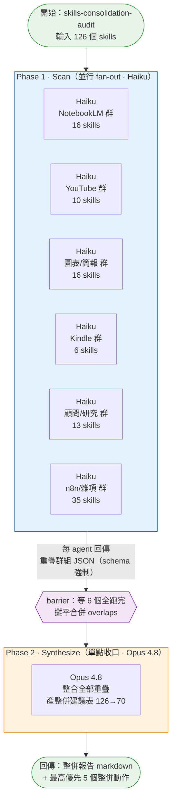

# 看不懂 JS？把 Dynamic Workflow「圖像化」看懂它在做什麼

**示範對象**：`skills-consolidation-audit-wf_cbc3ca28-0be.js`（Claude Code dynamic workflow 產生的 JS）

---

## 一、不會看 code 怎麼辦？方法總則

別人丟你一支 workflow JS，**你不用自己讀 code**。對 Claude 說：

> 「讀這支 workflow JS，用白話 + Mermaid 流程圖告訴我它在做什麼」

Claude 會幫你抽出三個關鍵維度，這就是「看懂一個 workflow」的全部：

| 維度 | 看什麼 | 在 JS 裡對應 |
|---|---|---|
| **階段（phase）** | 分幾大步、順序 | `meta.phases` + `phase('...')` |
| **派幾個 agent、用什麼模型** | 規模與成本 | `agent()` / `parallel()` / `pipeline()`、`model:` |
| **平行還是接力** | 同時跑還是排隊 | `parallel()`=同時、`pipeline()`=接力、`await`=等 |

只要看懂這三件，就知道「它做了什麼、多大、多貴」。

---

## 二、這支 workflow 的白話說明

**一句話**：把你 126 個 Claude skills 分成 6 群，**同時派 6 個便宜的 Haiku agent** 各掃一群找「功能重疊、可合併」的，最後**派 1 個聰明的 Opus agent** 把發現整合成一張「126→70 整併建議表」。

**逐步拆解**：

1. **Phase 1 — Scan（掃描，鋪廣度）**
   - 把 126 skills 按領域分 6 群（NotebookLM / YouTube / 圖表簡報 / Kindle / 顧問研究 / n8n雜項）
   - `parallel()` **同時**派 6 個 **Haiku**（便宜模型）agent，一群一個
   - 每個 agent 只讀各 SKILL.md 前 12 行的 description（省 token），找出「功能高度重疊」的群組
   - 每個 agent 被 `schema` 強制回傳結構化 JSON（cluster / skills_reviewed / overlaps）

2. **barrier（收集）**
   - `parallel()` 會等 6 個全部跑完才往下（這叫 barrier）
   - 把 6 份結果的 overlaps 攤平合併成一個大清單

3. **Phase 2 — Synthesize（收口，要品質）**
   - 派 **1 個 Opus 4.8**（聰明模型）agent
   - 餵它全部重疊清單，產出繁中整併建議報告（整併表 / 可廢棄 / 維持獨立 / 預估數量）

4. **回傳**：掃描群數、已掃 skill 數、找到幾組重疊、整併前後數字、最高優先 5 個整併動作、完整 markdown 報告

**設計亮點**：混合模型——鋪廣度的雜活用 Haiku（省錢），最後收口判斷用 Opus（品質）。這就是「fan-out 找廣度 + 單點收口」的經典 pattern。

---

## 三、Mermaid 流程圖

---

## 四、怎麼快速判斷一個陌生 workflow「貴不貴 / 大不大」

| 指標 | 怎麼看 | 這支的答案 |
|---|---|---|
| agent 總數 | 數 `agent()` 呼叫 × 迴圈/map 次數 | 6（scan）+ 1（synth）= 7 |
| 模型分布 | 看每個 `agent()` 的 `model:` | 6 Haiku（便宜）+ 1 Opus（貴） |
| 平行度 | `parallel()` = 同時、`pipeline()` = 接力 | scan 全平行（快） |
| 有沒有無限迴圈 | 看 `while` / `loop until` | 無（固定 2 phase，安全） |
| 會不會改你的檔案 | agent prompt 有沒有叫它 Write/Edit/Bash | 只讀 SKILL.md（唯讀，安全） |

**安全提示**：陌生 workflow 最該確認的是「**它會不會動我的檔案 / 系統**」。看 agent prompt 裡有沒有要它寫檔、刪檔、跑指令。這支只讀不寫，安全。

---

*由 Claude Code（Opus 4.8）讀取 JS 後產出。任何 workflow JS 都能這樣「圖像化」看懂。*
