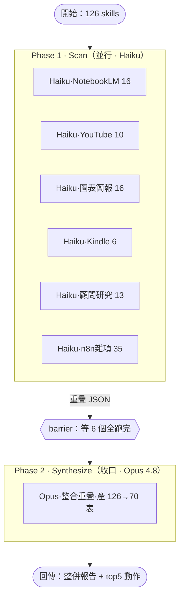

# Dynamic Workflow 能不能做「演化式開發」？— 與自建 Harness 的深度對照與實證

**日期**：2026-05-30
**作者**：楊政憲（與 Claude Code 協作）
**主題**：比較「自建 podcastbrain autonomous-loop harness」與「Anthropic Claude Code 的 Dynamic Workflow（`Workflow` 工具）」在「演化式 / 堆疊式開發」上的能力差異，並用兩個**真實跑過**的案例佐證。

---

## TL;DR（一分鐘看完）

- **問題**：workflow 產生的 JS 腳本能改嗎？它能不能像我的 harness 那樣 v1→v2→v3 堆疊演化，還是只能一次性生成？
- **答案**：**能改、也能堆疊演化** —— 但不是「工具自動幫你長大」，而是**你要把演化紀律自己寫進 JS**，就像你在 harness 是寫進 `app_spec` / `initializer_prompt` / `coding_prompt`（純文字）。
- **本質**：兩者都是「模型自寫 Harness」，差別只在**載體語言**（shell+文字 prompt vs JS）與**狀態是否內建**（harness 有 `feature_list.json`+git；workflow 預設沒有，要自建）。
- **實證**：本筆記用一個 80 行的 `evolving-builder-demo` workflow，**真的跑了兩代**（v1 建 2 功能 → v2 鎖住 2 個 stable、只 APPEND 第 3 個 Q&A），證明 dynamic workflow 可以做到 podcastbrain 式的「鎖 stable、只攻 new」堆疊演化。

---

## 一、緣起：使用者的問題

使用者自建了一個 **podcastbrain-harness**：一個 autonomous CLI loop，餵它三份文字檔（`app_spec.txt` 規格、`initializer_prompt.md` 初始化角色、`coding_prompt.md` 編碼角色），它就會自己一輪一輪把功能蓋出來，狀態靠 `feature_list.json` + git 外部化。最關鍵的是它能**演化**：換上新版 spec（v2、v3）重跑，會用 APPEND 模式「鎖住已通過的舊功能、只新增沒涵蓋的新功能」，做到 v1→v2→v3 的增量堆疊而不打掉重練。

看到 Anthropic 最新的 **Dynamic Workflow**（`Workflow` 工具，模型即時自寫 JS 編排腳本、背景跑 multi-agent）後，使用者的疑問是：

> 「這些新產生的 workflow JS 檔可以改嗎？我的 harness 是 v1/v2/v3 一層一層堆上去的；如果 workflow 產生的是 JS 檔，要怎麼做這種演化式開發？有沒有辦法？還是它只能一次性生成？Claude 最新的 dynamic workflow 有沒有辦法模擬這種演化堆疊？」

---

## 二、兩種範式

| | **podcastbrain harness** | **Dynamic Workflow（`Workflow` 工具）** |
|---|---|---|
| 是什麼 | 自建的 autonomous coding loop（shell 腳本驅動 `claude -p`） | Claude Code 內建功能：模型即時自寫 JS 編排腳本，背景執行多 agent |
| 編排載體 | shell + 三份文字 prompt | 一支 `.js`（模型自己寫的 harness） |
| 執行單位 | 每圈一個全新 context 的 `claude` session | `agent()` / `parallel()` / `pipeline()` 派出的 subagent |
| 狀態 | **外部化**：`feature_list.json` + git（永久、跨機、跨 session） | **預設無**；要演化得自己建 state 檔 |
| 無人值守 | ✅ 可掛 cron / systemd | ❌ 每次需使用者明確 opt-in |
| 強項 | 永久、可排程、為演化而生 | 即時 fan-out 鋪廣度、混合模型、對抗驗證、budget 控制 |

---

## 三、「能不能改 JS」——三個層次

| 層次 | 機制 | 對應 harness 的什麼 |
|---|---|---|
| **L1 改檔** | 每支 workflow JS 自動存到 `<session>/workflows/scripts/*.js`，就是純文字檔。隨便用 Write/Edit 改，再 `Workflow({scriptPath})` 重跑 | = 改 `app_spec.txt` 再重跑 |
| **L2 resume + 快取** | 重跑加 `resumeFromRunId`：**沒改動的 `agent()` 前綴直接回傳快取，第一個改動處之後才真的重跑**。同腳本同 args = 100% 命中 | = 「鎖 stable 紅燈、只攻 new 綠燈」，但**只在同一 session 內有效** |
| **L3 外部狀態演化** | 腳本讀外部 state 檔 → APPEND 新項目 → 只 build 新的 → 寫回。重跑就堆下一層 | = **真正等價於 feature_list.json + git 演化**（跨 session、永久） |

L1/L2 是工具直接送的；**L3 才是「跨版本永久堆疊」，要自己寫。**

---

## 四、兩種「演化」要分清楚

問題裡其實混了兩件事：

1. **演化「編排流程」本身**（那支 JS）：直接改 JS——加 phase、加 agent、改 schema。可以 git 成 `wf_v1.js → wf_v2.js`，或原地 edit。這跟改 spec 一樣，**毫無問題**。
2. **演化「workflow 蓋出來的產物」**（像 podcastbrain 那個 app）：這才需要**外部狀態 + APPEND 邏輯**。workflow 可以讀 state 檔、只建新功能、寫回、重跑堆疊。**也做得到，但要自己設計。**

---

## 五、案例 A：podcastbrain harness 的真實三代演化

這是「演化式開發」的黃金標準，本專案真實跑過（VPS `claude@187.127.109.145`）：

```
d47a810  Initialize v1：feature #1-8（Audio Downloader MVP）
a86abf9  Session 2：v1 全 8 功能通過
4f06d19  Evolve to v2：APPEND #9-16（download→transcribe→chapters），v1 #1-8 鎖 stable
f77e211  Implement v2 pipeline
a67e32a  Session 3：v2 全 16 功能通過
ef24004  Verify v3：21 功能全通過（5 個 v3 新功能 #17-21 驗證）
68eb684  Session 4：v3 全 21 功能通過
```

### v3 演化怎麼跑的（2026-05-30 本日實作）
1. **git 快照**：對現有專案打 tag `v2-stable-16features`（可一鍵回滾）
2. **部署 v3 三件套**：`app_spec_v3.txt`（Full Analysis + Q&A）+ 演化版 `initializer_prompt_v3.md` + `coding_prompt_v3.md`
3. **手動跑 APPEND initializer**（關鍵：loop 設計只在 `feature_list.json` 不存在時跑 initializer，所以要手動觸發 APPEND）→ 它**語意 dedup**：認出 v3 spec 的「下載/Whisper/章節」已被 #1-16 涵蓋，**只附加** #17 Full Analysis、#18 Q&A、#19 Q&A 歷史、#20 qa_history 表、#21 claude_analysis 欄位
4. **coding loop**（紅綠燈護欄鎖 1-16、只攻 17-21）→ 全部建好、21/21 通過
5. **成本**：APPEND init $1.20 + coding $3.52 ≈ **$4.72**

### 演化正確性的鐵證
- 原 16 功能**毫髮無傷**（紅燈鎖死）
- 新功能視覺驗證通過：四分頁 Episode Viewer（Summary / Transcript / Chapters / Q&A），Summary 顯示 Overview + Key Quotes + Action Items + Speakers，Q&A 顯示 grounded 回答帶 timestamp 引用 + 歷史保存
- Footer 自動升級 v2 → v3

**為什麼 harness 演化有效？三條不變量：**
1. **狀態外部化**：`feature_list.json` + git（不在對話、不在 harness 程式碼）
2. **冪等 + APPEND-aware**：重跑讀既有狀態、鎖通過者、只附加沒涵蓋的
3. **每個功能可獨立驗證**：passes 由瀏覽器測試決定

---

## 六、案例 B：用 Dynamic Workflow 複製演化（真實實證）

為了證明「workflow 也能堆疊演化」，寫了一個 80 行的 `evolving-builder-demo` workflow，把 harness 的三條不變量翻譯進 JS，**真的跑了兩代**。

### 設計
- `args` 傳入 `{version, statePath, spec}`
- **Phase Append**：派 agent 讀 state 檔（workflow 腳本本體 sandbox 無 fs，必須派 agent 做 I/O）→ JS 在腳本內做 APPEND diff（只挑 spec 裡 state 沒涵蓋的）
- **Phase Build**：`parallel()` 只對新功能派 builder（鎖住既有 stable）
- **Phase Persist**：派 agent 把合併後的 feature_list 寫回 state 檔

### 第 1 代（v1，從空 state）
- 輸入 spec：`Audio Input`、`Transcription`
- 結果：`total:2, appended:2`，state 檔建立
- 用量：4 agent / 497k token / 171s

### 第 2 代（v2，讀第 1 代的 state）
- 輸入 spec：`Audio Input`、`Transcription`、`Q&A`（3 個）
- 結果：**`locked_stable:2, appended_this_run:1, appended_names:["Q&A"]`**
- 最終 state 檔：
  ```
  #1 [x] Audio Input    (stable, v1)   ← 第1代建立，第2代鎖住沒動
  #2 [x] Transcription  (stable, v1)   ← 第1代建立，第2代鎖住沒動
  #3 [ ] Q&A            (new,    v2)   ← 第2代才 APPEND 進來
  ```
- 用量：3 agent / 362k token / 34s

### 四個證明點（全對應 harness）

| 證明 | 實測 | = podcastbrain 的什麼 |
|---|---|---|
| APPEND 語意 dedup | v2 給 3 個，認出 2 個已存在、只加 Q&A | initializer APPEND「只附加沒涵蓋的」 |
| 鎖 stable | 前 2 個標 stable、沒重建 | 紅綠燈護欄鎖 passes=true |
| 外部狀態跨 run 留存 | 第1代寫的 state，第2代讀到並堆疊 | feature_list.json + git |
| 只攻 new | 只派 1 個 builder 給 Q&A | coding loop 只跑未通過的 |

### 美妙巧合
第 2 代的 Q&A builder **誠實回 `passes:false`**（note：「等待逐字稿內容和問題輸入，無法實作」），拒絕假裝做完——跟 podcastbrain coding loop 一樣：沒真正驗證通過就維持 false，下次 re-run 會再試（= 迭代圈）。

---

## 七、對照總表

| | podcastbrain harness | dynamic workflow |
|---|---|---|
| 編排載體 | shell + 文字 prompt | 模型自寫 JS |
| 狀態 | feature_list.json + git（外部、永久） | 預設無；演化要自建 state 檔 |
| 鎖 stable | passes=true 紅燈 + coding prompt 護欄 | resume 快取（同 session）或自寫 skip |
| 演化方式 | 換 spec 重跑，APPEND | 改 JS / 改 args 重跑（+ 自建 APPEND） |
| 無人值守 | ✅ cron | ❌ 需 opt-in |
| 強項 | 永久、跨機、可排程 | 即時 fan-out、混合模型、對抗驗證、budget |
| 本質 | 為演化而生的專用框架 | 通用 multi-agent 編排器 |

---

## 八、How-to：用 workflow 複製 harness 演化（程式碼配方）

把 harness 的三條不變量寫進 JS：

```javascript
export const meta = {
  name: 'evolving-builder',
  description: '用外部 state 檔做 APPEND 演化堆疊',
  phases: [{title:'Append'},{title:'Build'},{title:'Persist'}],
}

// ⚠️ 防禦：args 可能以字串抵達 → 先 parse
const A = (typeof args === 'string') ? JSON.parse(args) : (args || {})
const STATE = A.statePath, VERSION = A.version, SPEC = A.spec

// ⚠️ 腳本本體 sandbox「無 fs」→ state 讀寫一律派 agent
phase('Append')
const state = await agent(`讀 ${STATE}，回 {"features":[...]}；不存在回 {"features":[]}`, {schema: STATE_SCHEMA, model:'haiku'})
const feats = state.features || []
const existing = new Set(feats.map(f => f.name))
const locked = feats.filter(f => f.passes)                          // 鎖 stable
const baseId = feats.reduce((m,f) => Math.max(m, f.id), 0)
const toAdd = SPEC.filter(s => !existing.has(s.name))               // APPEND diff：只挑沒涵蓋的
                  .map((s,i) => ({id: baseId+i+1, ...s}))

phase('Build')                                                       // 只攻 new，index 對應（別靠 name）
const built = await parallel(toAdd.map(f => () =>
  agent(`實作「${f.name}」並驗證。【嚴禁】用任何工具或建檔，只回結構化結果。`, {schema: BUILD_SCHEMA, model:'haiku'})))

const merged = [
  ...feats.map(f => f.passes ? {...f, status:'stable'} : f),
  ...toAdd.map((f,i) => ({id:f.id, name:f.name, passes: built[i]?.passes ?? false, status:'new', version_added:VERSION})),
]

phase('Persist')                                                     // 外部化寫回 → 跨 session 留存
await agent(`把這份 JSON 覆寫進 ${STATE}：${JSON.stringify({features: merged})}`, {schema: PERSIST_SCHEMA})

return { version: VERSION, locked_stable: locked.length, appended: toAdd.length }
```

**重跑演化**：`Workflow({name:'evolving-builder', args:{spec: v3功能清單}})` → 讀到 state 已有 v1+v2 → 鎖住、只加 v3 沒涵蓋的 → 堆第三層。**這就是 v1→v2→v3，用 JS 寫。**

---

## 九、踩坑紀錄（真實踩過）

| 坑 | 症狀 | 修法 |
|---|---|---|
| **args 變字串** | `TypeError: undefined is not an object (SPEC.filter)` | 腳本內 `typeof args==='string' ? JSON.parse(args) : args` 防禦 |
| **build agent 雞婆建檔** | 說「不用真寫程式」，haiku agent 還是建了真 `.py` | prompt 加「【嚴禁】使用 Read/Write/Edit/Bash 或建任何檔案」 |
| **name-map 對不上** | merged 的 passes 全 false（`builtMap.get(name)` 落空） | 改用 **index 對應** `built[i]`，不靠 name |
| **腳本本體無 fs** | 想在 JS 直接讀寫檔案會失敗 | state I/O 一律派 agent（agent 才有檔案工具） |
| **無 Date.now / Math.random** | 用了會 throw（為了 resume 決定性） | 時間戳用 args 傳，隨機性用 index 變化 |
| **token 成本** | 每個 subagent ≈ 120k+ token（base context 大） | 演化 demo 兩代約 86 萬 token；正式用要控 agent 數 |

---

## 十、限制（誠實面對）

1. **resume 快取只限同 session**：跨 session 不能靠快取免重建 stable，得靠**自己的 state 檔 + skip 邏輯**（跟 harness 一樣）。
2. **workflow 是「跑完回傳」的背景工作，不是常駐 daemon**：「演化」= 你重新 invoke（改腳本或改 args），不是它自己持續長大。
3. **每次要明確 opt-in**：不像 harness 可掛 cron 無人值守。
4. **腳本沙箱**：無 fs / 無 Date.now / 無 Math.random / 無 Node API。

---

## 十一、結論

> **Anthropic 的 dynamic workflow 能不能模擬演化堆疊，還是只能一次生成？**

**能堆疊，不是只能一次生成。** 但機制是：

- ❌ 不是 workflow「自己會長大」
- ✅ 是你給它**外部 state 檔 + APPEND 邏輯**，每次 re-invoke（換 args 或改 JS）就堆一層

**它跟 harness 的唯一本質差別**：podcastbrain 把演化紀律寫在 `app_spec`/`initializer_prompt`/`coding_prompt`（文字）；workflow 把同一套紀律寫在 JS。**兩者都是「模型自寫 harness」，只是語言不同。** Anthropic 沒內建 `feature_list.json` 那套，但你完全可以用 80 行 JS 自己組出來——本筆記就組出來、且實證了兩代堆疊。

**實務建議**：
- 要**永久、可排程、跨機**的演化專案 → 用 harness 模式（外部狀態 + cron）
- 要**即時、一次性的鋪廣度 / 對抗驗證 / 並行整併** → 用 workflow
- 兩者可結合：workflow 做單次重活，harness 做長期演化骨幹

---

## 十二、附錄：看不懂 JS？把 workflow「圖像化」看懂它

延伸問題：**別人丟你一支 workflow JS，你不會看 code，怎麼知道它在幹嘛？**

**方法總則**：對 Claude 說「讀這支 workflow JS，用白話 + Mermaid 流程圖告訴我它在做什麼」。看懂一個 workflow 只需三個維度：

| 維度 | 看什麼 | JS 裡對應 |
|---|---|---|
| **分幾大步** | 階段順序 | `meta.phases` / `phase()` |
| **幾個 agent、用什麼模型** | 規模 + 成本 | `agent()`、`model:` |
| **平行還接力** | 同時跑還是排隊 | `parallel()`=同時、`pipeline()`=接力、`await`=等 |

### 實例：`skills-consolidation-audit` 圖像化

**白話**：把 126 skills 分 6 群 → 同時派 6 個便宜 Haiku 各掃一群找重疊 → 等全跑完合併 → 派 1 個 Opus 收口產「126→70 整併建議表」。



（渲染 PNG：`mermaid/AI生成/20260530-workflow-visualize/consolidation-audit-flow.png`）

### 判斷「貴不貴 / 安不安全」

| 指標 | 怎麼看 | 此例 |
|---|---|---|
| agent 總數 | 數 `agent()` × map/迴圈 | 6+1=7 |
| 模型分布 | 各 `agent()` 的 `model:` | 6 Haiku + 1 Opus |
| 有無無限迴圈 | `while` / `loop until` | 無（固定 2 phase） |
| **會不會動我的檔案** | agent prompt 有無叫它 Write/刪檔/跑指令 | **只讀不寫，安全** |

**安全提示**：審查陌生 workflow，最該確認的是「它會不會改我的檔案 / 系統」——看 agent 指令裡有沒有寫檔、刪檔、跑指令。

---

## 十三、怎麼對一支現成 workflow JS 做「演化式修改」

看懂之後要演化修改，分兩種：

### A. 演化「編排本身」（最常見）
```
1. 找腳本檔   ← <session>/workflows/scripts/*.js
2. 改 JS      ← 自己 Edit 或叫 Claude「加一個 Phase 做 X」
3. 重跑       ← Workflow({scriptPath})
```
**演化加速器**：重跑加 `resumeFromRunId`：
```js
Workflow({ scriptPath: "...wf.js", resumeFromRunId: "wf_xxx" })
```
→ 沒改動的 `agent()` 前綴回快取（不重跑、不花錢），第一個改動處之後才執行。**在尾端加東西，只付新增部分的錢** = v1→v2 演化。

**實例**：把 `consolidation-audit`（2 phase）演化加第 3 phase「對抗驗證」，只在檔尾 append：
```js
// ↓ 演化新增 Phase 3（原 Scan/Synthesize 完全不動）
phase('Verify')
const verdict = await agent(
  `你是 skeptic。審查這份整併建議有無「雙觸發衝突 / 名實不符」：\n${report.markdown}`,
  { label: 'verify:skeptic', phase: 'Verify', schema: VERIFY_SCHEMA, model: 'sonnet' }
)
return { ...report, verdict }
```
重跑 + resume → Phase 1（6 Haiku）+ Phase 2（Opus）秒回快取，只跑新 Phase 3。

### B. 演化「產物」（workflow 蓋的是有狀態的東西）
用案例 B 那套：外部 state 檔 + APPEND（讀舊 → 鎖 stable → 只加新 → 寫回）。

### 演化修改鐵律（= 快取命中關鍵）

| 規則 | 為什麼 |
|---|---|
| **新東西加尾端，別動前面 `agent()`** | 快取 key 是 `(prompt, opts)` 逐字比對；改到前面 → 之後全失效重跑 |
| **改 prompt = 那步以後全重跑** | 想省錢只 append、不改既有 |
| **同 args 才命中** | args 變了 = 新任務 |
| **跨 session 快取失效** | resume 只限同 session；跨天演化靠自己存 state 檔 |

**對照 podcastbrain**：「別動前面 agent」=「別動 stable feature」；resume 快取 = 紅燈鎖死。**同一套紀律，換 JS 表達。**

---

*本筆記由 Claude Code（Opus 4.8）協作產出，所有案例數字來自 2026-05-30 本機與 VPS 真實執行紀錄。*
